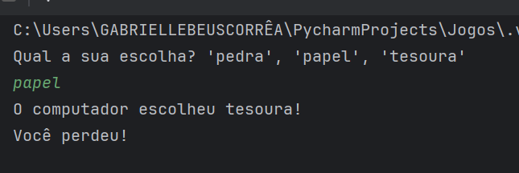

# ✊✋✌️ Jogo - Pedra, Papel e Tesoura

# 📋❗ Regras do jogo:
1. Ao iniciar o jogo você deve escolher as seguintes opções: predra, papel e tesoura.
2. Se você não escolher as seguintes opções irá retornar uma mensagem avisando.
3. Lembre-se! Pedra > Tesoura, Tesoura > Papel e Papel > Pedra. 
4. Atenção! Você esta jogando com um computador que também pode escolher entre as mesmas opções: pedra, papel e tesoura.

# 👩‍💻 Desenvolvimento do jogo
O jogo foi desenvolvido a partir dos estudos sobre Python durante as aulas de Técnico por uma aluna do 2° do E.M.

